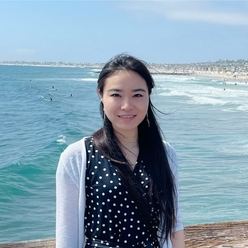

### **About me**

I'm currently a Ph.D. candidate in the Department of Computer Science at the University of California, Irvine (UCI), working with [Prof. Ardalan Amiri Sani](https://www.ics.uci.edu/~ardalan/). I received my B.Sc. degree from Huazhong University of Science and Technology (HUST), Wuhan, China. Before coming to UCI, I worked with [Prof. Chen Tian](https://cs.nju.edu.cn/tianchen/index.htm) on datacenter networks. 

My research focuses on the intersection of operating systems, security, and programming analysis. I enjoy building reliable systems to solve realistic problems in both software engineering and operating systems.

### **Contact me**

_Email:  yingtong at uci dot edu_

_Office:  Donald Bren Hall #3231_

### **Publications**

Yingtong Liu, Hsin-Wei Hung, Ardalan Amiri Sani. [Mousse: A System for Selective Symbolic Execution of Programs with Untamed Environments](https://github.com/Yingtong-Liu/Yingtong-Liu.github.io/blob/main/EuroSys20_Mousse_Yingtong.pdf). _In Proc. ACM European Conference on Computer Systems (EuroSys), April 2020. [(source code)](https://trusslab.github.io/mousse/) [(slides)](https://github.com/Yingtong-Liu/Yingtong-Liu.github.io/blob/main/Mousse_Yingtong_slides_long.pdf)_

Zhihao Yao, Zongheng Ma, Yingtong Liu, Ardalan Amiri Sani, Aparna Chandramowlishwaran. [Sugar: Secure GPU Acceleration in Web Browsers.](https://www.ics.uci.edu/~ardalan/papers/Yao_ASPLOS18.pdf) _In Proc. ACM Int. Conf. Architectural Support for Programming Languages and Operating Systems (ASPLOS), March 2018.[(source code)](https://trusslab.github.io/sugar/)_

Chen Tian, Ali Munir, Alex X. Liu, Yingtong Liu, Yanzhao Li, Jiajun Sun, Fan Zhang, and Gong Zhang. [Multi-Tenant Multi-Objective Bandwidth Allocation in Datacenters Using Stacked Congestion Control.](https://github.com/Yingtong-Liu/Yingtong-Liu.github.io/blob/main/c3_infocom17.pdf) _In Proceedings of IEEE International Conference on Computer Communications (INFOCOM), 2017._

### **My cat**

[Taco](https://drive.google.com/drive/u/1/folders/1EOdUHqBvzgyymPQ0aS11SF9LzkQnP70I) was born on 09/17/2017. I adopted her from Irvine Animal Care Center when she was 3 months old. She is shy and noughty at the same time.

### **Books**

- [The Screwtape Letters](http://www.samizdat.qc.ca/arts/lit/PDFs/ScrewtapeLetters_CSL.pdf) by C.S. Lewis

- [The Problem of Pain](http://www.samizdat.qc.ca/cosmos/philo/PDFs/ProblemofPain_CSL.pdf) by C.S. Lewis

### **Social Media**

- [Instagram](https://www.instagram.com/yingtong_liu/)
- [Medium](https://medium.com/@liuyingtonghust)
- [Linkedin](https://www.linkedin.com/in/yingtong-liu-9ba23396/)

### **Find my [CV](https://github.com/Yingtong-Liu/Yingtong-Liu.github.io/blob/main/Yingtong_cv.pdf)** 
