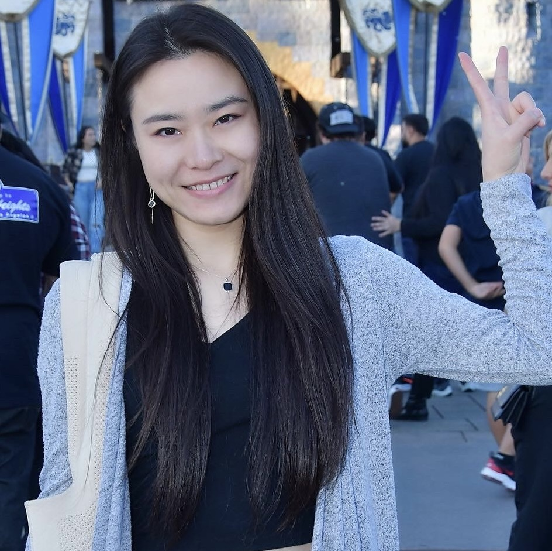

### **About me**
I am a Senior Software Engineer at [Certik](https://www.certik.com/), a leading company in Web3 security.

With extensive experience in software security, program analysis, operating systems, and blockchain security, I am passionate about leveraging automated program analysis techniques to enhance the security and reliability of software systems. My focus includes securing the critical implementations that power everyday technology, with a particular emphasis on operating systems. Additionally, I have a strong interest in designing and building high-performance, secure systems and infrastructures.

I received a Ph.D. in Computer Science from UC Irvine, advised by [Prof. Ardalan Amiri Sani](https://www.ics.uci.edu/~ardalan/). My research explores the intersection of operating systems and security. My work has been published in top-tier conferences, including ACM EuroSys, ACM MobiCom, and ACM ASPLOS. I have a B.Sc. degree from the Department of Computer Science of Huazhong University of Science and Technology (HUST). Before coming to UCI, I worked with [Prof. Chen Tian](https://cs.nju.edu.cn/tianchen/index.htm) on datacenter networks.

### **Contact me**

_Email:  liuyingtonghust at gmail dot com_

### **Publications**

Hsin-Wei Hung, Yingtong Liu, Ardalan Amiri Sani. [Sifter: Protecting Security-Critical Kernel Modules in Android through Attack Surface Reduction](xxx).
_Accepted to ACM Int. Conf. Mobile Computing and Networking (MobiCom), October 2022_

Yingtong Liu, Hsin-Wei Hung, Ardalan Amiri Sani. [Mousse: A System for Selective Symbolic Execution of Programs with Untamed Environments](https://github.com/Yingtong-Liu/Yingtong-Liu.github.io/blob/main/EuroSys20_Mousse_Yingtong.pdf). _In Proc. ACM European Conference on Computer Systems (EuroSys), April 2020. [(source code)](https://trusslab.github.io/mousse/) [(slides)](https://github.com/Yingtong-Liu/Yingtong-Liu.github.io/blob/main/Mousse_Yingtong_slides_long.pdf)_

Zhihao Yao, Zongheng Ma, Yingtong Liu, Ardalan Amiri Sani, Aparna Chandramowlishwaran. [Sugar: Secure GPU Acceleration in Web Browsers.](https://www.ics.uci.edu/~ardalan/papers/Yao_ASPLOS18.pdf) _In Proc. ACM Int. Conf. Architectural Support for Programming Languages and Operating Systems (ASPLOS), March 2018.[(source code)](https://trusslab.github.io/sugar/)_

Chen Tian, Ali Munir, Alex X. Liu, Yingtong Liu, Yanzhao Li, Jiajun Sun, Fan Zhang, and Gong Zhang. [Multi-Tenant Multi-Objective Bandwidth Allocation in Datacenters Using Stacked Congestion Control.](https://github.com/Yingtong-Liu/Yingtong-Liu.github.io/blob/main/c3_infocom17.pdf) _In Proceedings of IEEE International Conference on Computer Communications (INFOCOM), 2017._

### **My cat**

[Taco](https://drive.google.com/drive/u/1/folders/1EOdUHqBvzgyymPQ0aS11SF9LzkQnP70I) was born on 09/17/2017. I adopted her from [Irvine Animal Care Center](https://www.cityofirvine.org/irvine-animal-care-center) when she was 3 months old. She is both shy and naughty.

### **My favorite Books**

- [The Screwtape Letters](http://www.samizdat.qc.ca/arts/lit/PDFs/ScrewtapeLetters_CSL.pdf) by C.S. Lewis

- [The Problem of Pain](http://www.samizdat.qc.ca/cosmos/philo/PDFs/ProblemofPain_CSL.pdf) by C.S. Lewis

- [The Four Agreements](https://books-library.net/files/books-library.online-02171342Go0P8.pdf) by Don Miguel Ruiz

### **Social Media**

- [Instagram](https://www.instagram.com/yingtong_liu/)
- [Medium](https://medium.com/@liuyingtonghust)
- [Linkedin](https://www.linkedin.com/in/sheisy-yingtong-liu-9ba23396/)
- [Twitter](https://twitter.com/Yingtong_L)

### **Find my [CV](https://github.com/Yingtong-Liu/Yingtong-Liu.github.io/blob/main/Yingtong_cv.pdf)** 
